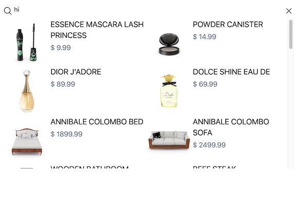

# Debounced Search

## Task 1

### Should show results as a drop down

- [x] The solution should use any appropriate React hooks
- [x] The solution should utilize debouncing for API interactions
- [x] Include any automated tests deemed necessary

### Notes

- Bootstrapping Project
  - I started a react project with Vite with Tailwind, and added Typscript, Jest, React Testing Library bc I'm familiar with these tools
  - I *am* open to others
- `debouncer`
  - I added a simple debouncer to reduce the need of importing other packages, and demonstrate how I test.
  - for debouncer, I mainly tested the debounced function and checked that it:
    - didn't call the callback until the delay was reached
    - called the callback with the correct arguments
    - bounced all calls prior to the last
    - continuted to call the callback after the an appropriate amount of time
- `SearchBar`
  - simple component that could be reused
- `useProduct`
  - where the magic happens:
    - calls end point and returns data
    - uses good ol `fetch` but we can switch to there module since it's dependency injected
    - I could/would break this appart more if we were calling other endpoints
- Automated tests
  - just checked on the three outcomes:
    - loading
    - successfully queried data
    - error
